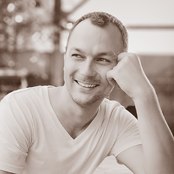

# ZALUTSKI ALEXANDR NICKOLAEVICH
## FRONTEND - DEVELOPER (JUNIOR)
 

>### Mogilev, Republic of Belarus 
>### Age: 35 years
## WORK EXPERIENCE
---
### **from 2008 to 2018 (10 years)**
Sellwin, Dilis, «Rysskie sladosti»
Sales agent, Supervisor (head of a team of 5 people)
### **from 09.2018 until now (2 year and 4 months)**
Unitary enterprise «A1»
Customer service specialist
- execution of monthly plans
- work with clients
- accounting
## EDUCATION
---
### **2004**
### Mogilev state polytechnic technical school

*Commissioning and operation of electronic systems with software control in production*

*Electrical technician*

*Full-time education*
### **2010**
### Belarusian-Russian University

*Electrotechnical faculty*

*Electrical engineer*
## WORK EXPERIENCE
---

*Distance learning*
### **2020**
### Computer Academy «SHAG» (Mogilev)

*Frontend - developer*

*Full-time education*

## ADDITIONAL INFORMATION
---
- Scripting Languages: JavaScript
- Software Construction: React JS, Redux, TypeScript, Webpack, Bootstrap
- Software Management: Git, GitHub
- Development Tools: BEM Methodology, NPM, Visual Studio Code, WebStorm

- [Examination work in «SHAG» on GitHub](https://github.com/Aleks-Zal/reactTestExam.git)
## CONTACTS
---
+375(29)617-13-85 (A1)

Write a letter to me <simplesash@gmail.com>

[I'm on LinkedIn](https://www.linkedin.com/in/alexandr-zalutski/)
## LANGUAGES
---
English (A2) Pre-Intermediate

*At the moment I am studying in the "Streamline" in the A2+group*
## SKILLS
---
- HTML5, CSS3, ES6
- Java Script
- React
- Git
- Sass
- Redux
- TypeScript
- Bootstrap
## OTHER
---
Marital status: *Single, no children*

Employment: *full*

Working hours: *full day*

Citizenship: *Belarus*

Driver's license: *B*

*I want to devote myself entirely to working in IT, develop as a professional and i’m ready to work in a team of initiative people.*
